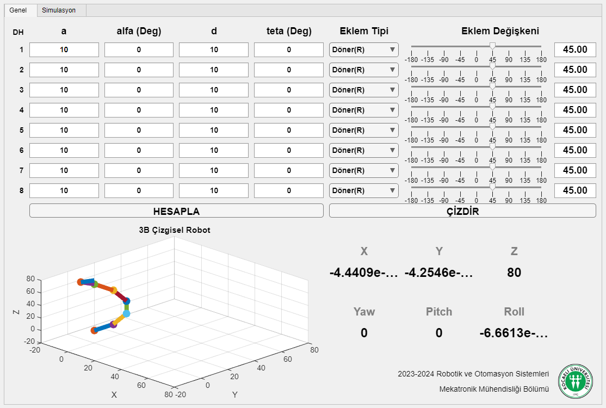
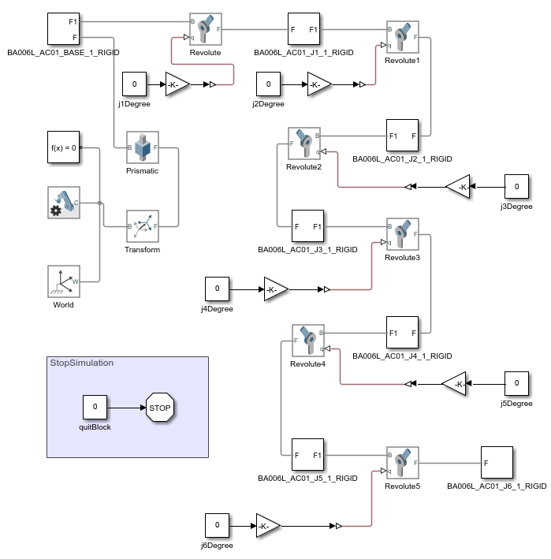
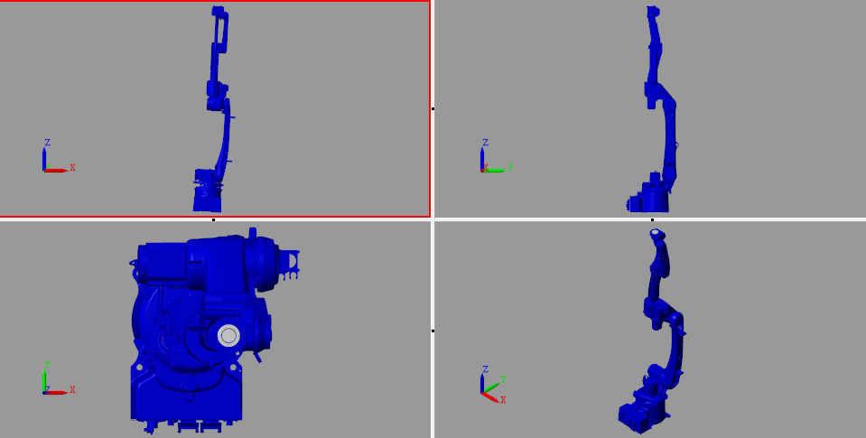
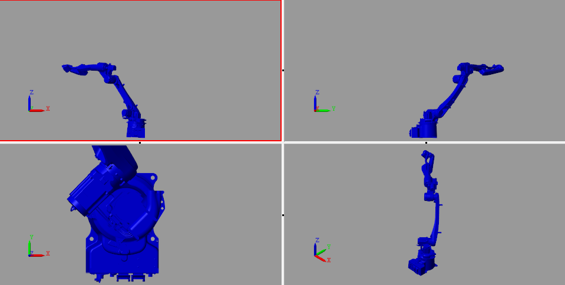

# Manipulator Control With Matlab GUI

- It was the first project I wrote in the field of robotic applications. Since I had technical difficulties, I could not pay attention to the robust work or layout of the project. I have no idea if it works right now, but thanks to this project, I am developing my parallel delta robot project. I will develop this project at the first opportunity.

